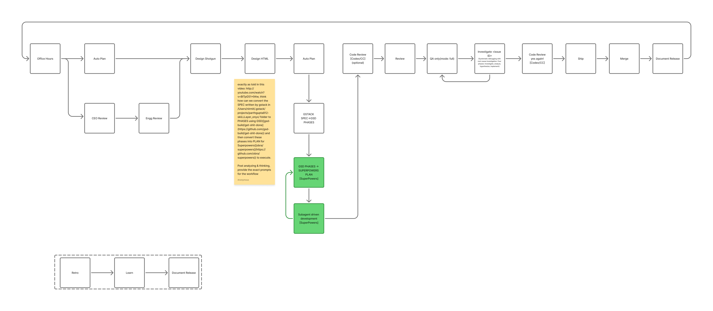

# Agile Loop

Agile Loop is an agent workflow skill for Claude Code, Codex, Anti-gravity, and similar coding agents. It runs an autonomous engineering queue with fresh child sessions for each major stage: planning, implementation, review, QA, shipping, human merge, and release documentation.

The workflow is portable across agent hosts. This repo currently includes a Codex CLI runner adapter plus shared queue, dashboard, prompt contracts, and documentation that other hosts can reuse.

It combines three complementary skill families:

- GStack creates specs through role-based product and engineering review.
- GSD turns those specs into smaller phases so each execution session starts with a focused context window.
- Superpowers turns each phase into a concrete plan and executes it with test-first, subagent-driven development.

Vocabulary matters in this repo: GStack produces specs, GSD produces phases, and Superpowers produces plans.

## Workflow



The diagram shows the full loop:

- Discovery and planning start with Office Hours, Auto Plan, CEO Review, and Eng Review.
- Design and planning convert product intent into GStack specs, GSD phases, and Superpowers plans.
- Execution runs in fresh agent sessions with CodeRabbit, GStack review, QA, investigation, ship, merge, and document-release gates.
- Retro, Learn, and Document Release feed the next cycle.

## Requirements

- An agent runtime capable of launching isolated/headless child sessions.
- For the included shell runner: Codex CLI available on `PATH` as `codex`.
- Python 3 for dashboard/status helpers.
- GitHub CLI available as `gh` for PR polling.
- Git available as `git`.
- The target repo should have the skills used by the prompts installed or available to your agent host: GStack, GSD, Superpowers, and CodeRabbit.

The runner defaults to `gpt-5.5` for planning/review/QA/ship and `gpt-5.4` for implementation. Override them with `--default-model`, `--implementation-model`, and `--review-model`.

## Install

One-command install auto-detects supported hosts on your machine:

```bash
curl -fsSL https://raw.githubusercontent.com/nirmitgoyal/agile-loop/main/scripts/install.sh | bash
```

Pass `--upgrade` to replace an existing install, and `--dry-run` to print destinations without writing.


## Queue Format

Create one Markdown file per task under `docs/agile-loop/tasks/` in the target repo:

```markdown
---
status: todo
title: Short task title
phase: optional-gsd-phase-id
---

## Objective
What to build.

## Inputs
Links to GSD phase docs, Superpowers plans, screenshots, issues, or acceptance notes.

## Done
Concrete acceptance criteria.
```

Supported statuses:

- `todo`: ready for the next loop iteration.
- `doing`: claimed by the current loop.
- `done`: PR was merged by a human.
- `blocked`: a child session blocked, tests failed, a PR was closed unmerged, or mandatory human judgment was required.

## Run

Always start with a dry run:

```bash
~/.codex/skills/agile-loop/scripts/agile-loop.sh \
  --repo /path/to/your/repo \
  --base main \
  --max-iterations 1 \
  --dry-run
```

With the included Codex adapter, real execution launches fresh child sessions with approval and sandbox bypass. This is intentionally gated:

```bash
~/.codex/skills/agile-loop/scripts/agile-loop.sh \
  --repo /path/to/your/repo \
  --base main \
  --max-iterations 10 \
  --poll-interval 60 \
  --unsafe-bypass-approvals
```

You can also set `AGILE_LOOP_UNSAFE_BYPASS=1` instead of passing the flag.

Start the dashboard in another terminal:

```bash
~/.codex/skills/agile-loop/scripts/agile-dashboard.py \
  --repo /path/to/your/repo \
  --port 8765
```

The dashboard serves `http://127.0.0.1:8765` by default and shows the active queue, current status, current stage, and blocked reason.

## Loop Contract

For each `todo` task, the included Codex runner performs one fresh `codex exec --ephemeral` invocation per agent-backed step:

1. Convert the GSD phase/task into a Superpowers implementation plan.
2. Execute the plan with `superpowers:subagent-driven-development`.
3. Run `coderabbit:code-review`.
4. Fix only Critical or Major CodeRabbit findings with scoped subagents.
5. Run `/review`.
6. Run `/qa-only mode: full`.
7. Fix QA issues with `/investigate` and scoped subagents.
8. Run CodeRabbit again.
9. Fix remaining Critical or Major findings only.
10. Run `/ship`.
11. Poll the PR until a human merges it, then sync the base branch and mark the task `done`.

Every failed stage gets three exponential-backoff retries before the task is blocked. Set `AGILE_LOOP_RETRY_INITIAL_SECONDS` to override the first retry delay. `RALPH_LOOP_RETRY_INITIAL_SECONDS` is still accepted for older setups.

## Guardrails

- Keep one PR per queued task.
- Stop on `BLOCKED`, `NEEDS_CONTEXT`, failed tests, missing authentication, mandatory user judgment, or closed-unmerged PR state.
- Delegate fixes only after CodeRabbit or QA findings exist.
- Keep remediation scoped to the finding source.
- Do not skip the human merge gate.
- Do not mark a task `done` until the configured base branch has synced with `origin/<base>` using `git pull --rebase`.

## Tests

```bash
bash -n scripts/agile-loop.sh
bash -n scripts/install.sh
python3 -m py_compile scripts/agile-dashboard.py
tests/test-agile-loop.sh
tests/test-install.sh
tests/test-agile-dashboard.sh
```

The runner tests use fake `codex`, `gh`, and `git` commands. The installer tests use temporary home/project directories. The dashboard test binds a local HTTP server.
